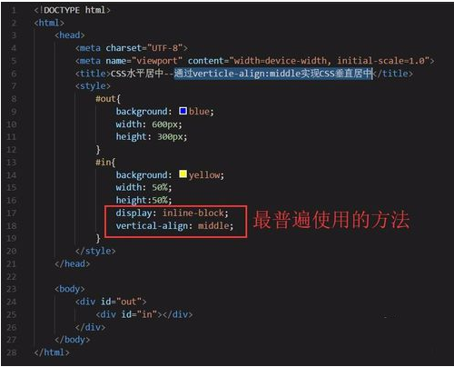
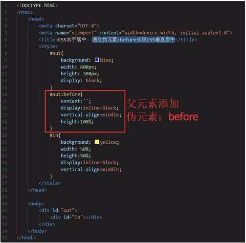
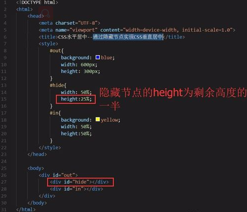
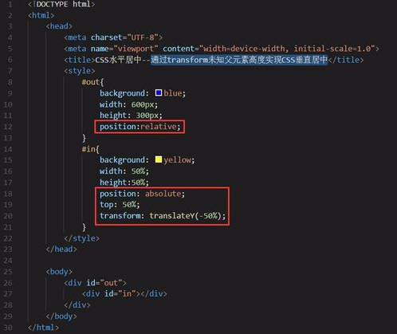

# 前端知识点汇总


### CSS
> 使元素垂直居中的方法
- 通过vertical-align:middle实现CSS垂直居中是最常使用的方法，但是有一点需要格外注意，vertical生效的前提是元素的display：inline-block。
- 
- 通过display:flex实现CSS垂直居中的方法是给父元素display:flex;而子元素align-self:center;这个跟CSS水平居中的原理是一样的，只是在flex-direction上有所差别，一个是row(默认值)，另外一个是column。
- 
- 通过伪元素:before实现CSS垂直居中。具体方式是为父元素添加伪元素:before，使得子元素实现垂直居中。
- 
- 通过display:table-cell实现CSS垂直居中。给父元素display:table，子元素display：table-cell的方式实现CSS垂直居中。
- 
- 通过隐藏节点实现CSS垂直居中。创建一个隐藏节点#hide，使得隐藏节点的height值为剩余高度的一半即可。这种方法也适用于CSS水平居中，原理一样
- 
- 已知父元素高度通过transform实现CSS垂直居中。给子元素的position:relative，再通过translateY即可定位到垂直居中的位置
- 
- 未知父元素高度通过transform实现CSS垂直居中。先给父元素position:relative，再给子元素position:absolute，通过translateY即可定位到垂直居中的位置。
- 

> 元素水平垂直居中(已知宽高)
- 设置父元素为相对定位，给子元素设置绝对定位，top: 0; right: 0; bottom: 0; left: 0; margin: auto;
```
    <style>
        #father {
            width: 500px;
            height: 300px;
            background-color: skyblue;
            position: relative;
        }
        #son {
            width: 100px;
            height: 100px;
            background-color: green;
            position: absolute;
            top: 0;
            right: 0;
            bottom: 0;
            left: 0;
            margin: auto;
        }
    </style>
 
    <div id="father">
        <div id="son">我是块级元素</div>
    </div>
```
- 设置父元素为相对定位，给子元素设置绝对定位，left: 50%; top: 50%; margin-left: --元素宽度的一半px; margin-top: --元素高度的一半px;
```
<style>
    #father {
        width: 500px;
        height: 300px;
        background-color: skyblue;
        position: relative;
}
 
    #son {
        width: 100px;
        height: 100px;
        background-color: green;
        position: absolute;
        left: 50%;
        top: 50%;
        margin-left: -50px;
        margin-top: -50px;
}
</style>
 
<div id="father">
    <div id="son">我是块级元素</div>
</div>
```
> 元素水平垂直居中(未知宽高)
- 设置父元素为相对定位，给子元素设置绝对定位，left: 50%; top: 50%; transform: translateX(-50%) translateY(-50%);
```
<style>
    #father {
        width: 500px;
        height: 300px;
        background-color: skyblue;
        position: relative;
}
 
    #son {
        background-color: green;
        position: absolute;
        left: 50%;
        top: 50%;
        transform: translateX(-50%) translateY(-50%);
}
</style>
 
<div id="father">
    <div id="son">我是块级元素</div>
</div>

```
>清除浮动的方法
- 使用额外的标签clear:both   原理：在浮动元素下面添加一个空标签，在这个标签中设置clear：both；   优点：简单，浏览器兼容性好；  缺点：增加页面的标签，造成页面混乱；
- 使用overflow属性   原理：父元素定义overflow:hidden，此时，浏览器会自动检查浮动区域的高度； 优点：简单，无需增加新的标签； 缺点：不能和position配合使用，因为超出的尺寸的会被隐藏；
- 使用伪元素:after清除浮动   原理：原理同方法一有点类似，在元素最后定义一个空的内容，然后让该空的内容来清除浮动；优点：无需额外的标签，浏览器兼容性好，是目前用的最多的一种清除浮动的方法之一；

>盒模型（box-sizing）
- 标准盒模型:   content的大小就是width和height设置的值。content实际占用的空间其实是padding+border+margin+width
- 在IE盒模型: 所设置的width和height就是包含了padding和border

> 选择器伪类
- 静态伪类：只能用于超链接的样式    :link 超链接点击之前   :visited 链接被访问过之后
- 动态伪类：针对所有标签都适用的样式   :hover “悬停”：鼠标放到标签上的时候      :active “激活”： 鼠标点击标签，但是不松手时     :focus 是某个标签获得焦点时的样式
- 超链接a标签： :link “链接”：超链接点击之前 、    :visited “访问过的”：链接被访问过之后 、  :hover “悬停”：鼠标放到标签上的时候、    :active “激活”： 鼠标点击标签，但是不松手时

> position几个属性
- position: relative;相对定位，不影响元素本身特性（无论区块元素还是内联元素会保留其原本特性），不会使元素脱离文档流（元素原本位置会被保留，即改变位置也不会占用新位置），没有定位偏移量时对元素无影响（相对于自身原本位置进行偏移），提升层级（用z-index样式的值可以改变一个定位元素的层级关系，从而改变元素的覆盖关系，值越大越在上面，z-index只能在position属性值为relative或absolute或fixed的元素上有效。）  （两个都为定位元素，后面的会覆盖前面的定位）
- position: absolute;绝对定位 ，1、使元素完全脱离文档流（在文档流中不再占位）2 使内联元素在设置宽高的时候支持宽高（改变内联元素的特性）3 使区块元素在未设置宽度时由内容撑开宽度（改变区块元素的特性）4 相对于最近一个有定位的父元素偏移（若其父元素没有定位则逐层上找，直到document——页面文档对象）5 相对定位一般配合绝对定位使用（将父元素设置相对定位，使其相对于父元素偏移）6 提升层级。
- position: fixed;固定定位
- position:static：默认值
- position: sticky 粘性定位   粘性定位，该定位基于用户滚动的位置。它的行为就像 position:relative; 而当页面滚动超出目标区域时，它的表现就像 position:fixed;，它会固定在目标位置。

> postion的值以及其之间的区别
- 


### ES6
> 列举常用es6特性：
- 申明变量let和const
- 可在传递参数除指定默认值
- 箭头函数写法更加简洁，省略了function关键字申明，省略return
- 模板字符串
- Promise链式调用
- 增加了class关键字来定义声明一个类，还多了extends继承关键字
- export导出模块、import导入模块
- 解构赋值react-redux状态管理库;用redux-logger打印日志，方便调试;用redux-thunk实现异步操作
> let, const, var 的区别
- var声明的变量会挂载在window上，而let和const声明的变量不会
- var声明变量存在变量提升，let和const不存在变量提升
- let和const声明形成块作用域
- 同一作用域下let和const不能声明同名变量，而var可以
>es6箭头函数的this
- 箭头函数的this是在定义函数时绑定的，不是在执行过程中绑定的。简单的说，函数在定义时，this就继承了定义函数的对象
>promise的状态、链式调用、同步异步流程、唯一性
- promise俗称链式调用，它是es6中最重要的特性之一，简单的说可以不停的then调用嵌套在调用（异步之后，链式调用方式执行回调），这种操作方式称为promise
- 包含两个参数： Resolve：将promise的状态设置为完成状态（resolved），此时then方法捕捉变化，执行成功的回调
    Reject：将promise状态设置为无效，（rejected），此时then方法执行失败回调
- Promise之All，等执行所有异步，完事之后执行then回调返回出数组数据类型
>set去重
- ES6中新增了Set数据结构，类似于数组，但是 它的成员都是唯一的 ，其构造函数可以接受一个数组作为参数
- ES6中Array新增了一个静态方法Array.from，可以把类似数组的对象转换为数组
>js数组去重
- 最简单的数组去重方法（indexOf方法）:新建一个数组，遍历去要重的数组，当值不在新数组的时候（indexOf为-1）就加入该新数组中(indexOf返回当前元素下标，没找到返回-1)
- 优化遍历数组法（推荐）: 双层循环，外循环表示从0到arr.length，内循环表示从i+1到arr.length,将没重复的右边值放入新数组


### js基础
>闭包
- 高阶函数除了可以接受函数作为参数外，还可以把函数作为结果值返回。
- 换句话说，闭包就是携带状态的函数，并且它的状态可以完全对外隐藏起来
- 闭包外部函数能够读取内部函数的变量
- 优点：闭包可以形成独立的空间，永久的保存局部变量。
- 缺点：保存中间值的状态缺点是容易造成内存泄漏，因为闭包中的局部变量永远不会被回收

>作用域
- 任何编程语言都有作用域的概念，简单来说，作用域就是变量与函数的可访问范围，即作用域控制着变量与函数的可见性和生命周期。
- 全部作用域：任何地方都能访问到的对象拥有全局作用域
- 局部作用域：局部作用域一般只在固定的代码片段内可访问到，最常见的例如函数内部，所以在一些地方会把这种作用域成为函数作用域
- ES6的块级作用域: 明确允许在块级作用域中声明函数，let和const命令都涉及块级作用域。
- 作用域链: 当声明一个函数时，局部作用域一级一级向上包起来，就是作用域链, 当执行函数时，总是先从函数内部找寻局部变量，如果内部找不到（函数的局部作用域没有），则会向创建函数的作用域（声明函数的作用域）寻找，依次向上

>字符串操作方法
- charAt(1)   返回给定位置的那个字符
- concat()    将一或多个字符串拼接起来，返回拼接得到的新的字符串
- slice（x，y):截取字符串，第一个x表示开始截取的位置，y表示结束截取的位置,不包含索引为y的
- subStr(x,y):截取字符串，第一个x开始截取的位置，y是表示要截取的个数
- substring() 方法用于提取字符串中介于两个指定下标之间的字符
- toFixed(x): 四舍五入取小数方法，x:表示保留2位小数
- replace() 方法用于在字符串中用一些字符替换另一些字符，或替换一个与正则表达式匹配的子串。stringObject.replace(regexp/substr,replacement)  1、regexp/substr 必需。规定子字符串或要替换的模式的 RegExp 对象。2、replacement 必需。一个字符串值。规定了替换文本或生成替换文本的函数。
- split() 方法用于把一个字符串分割成字符串数组。  1、参数一：必需。字符串或正则表达式，从该参数指定的地方分割    2、参数二：可选。该参数可指定返回的数组的最大长度
- trim()，会创建一个字符串副本,删除前置以及后缀的所有空格[IE8及一下不支持]
- search()方法,返回字符串中第一个匹配项的索引

>数组操作方法
- join()  将数组转化为字符串方法
- sort()  数组排序   没有参数的时候按字母表排序，arr.sort(function(a,b){return a-b;});     // 升序    arr.sort(function(a,b){return b-a;});     // 降序
- reverse()   数组反转
- push（）  进栈，可放入多个参数，返回插入的长度
- pop()   出栈，返回出栈那个值
- shift()   取出数组的第一个值，返回那个值
- unshift()   向数组的开头添加一个或更多元素，并返回新的长度，unshift() 方法在 IE下 失效！
- slice(start , end);         参数为数组下标，不包括end
- splice(start , length,[item1 , item2]……);     //从start剪切length长度的数组，可选参数为替换原数组剪切的内容
  使用splice方法在数组指定位置插入元素，index为插入的位置，array.splice(index, 0, 元素)

> 浅拷贝和深拷贝区别，描述或者手写深拷贝
-  浅拷贝：被复制对象的所有变量都含有与原来的对象相同的值，而所有的对其他对象的引用仍然指向原来的对象。即对象的浅拷贝会对“主”对象进行拷贝，但不会复制主对象里面的对象。”里面的对象“会在原来的对象和它的副本之间共享。
- 如果是基本数据类型，直接进行赋值操作，这样就相当于在栈内存中重新开辟了一个新的空间把值传递过去；如果是引用类型的值传递，进行的就是浅拷贝，浅拷贝赋值的只是对象的引用
- 深拷贝： 深拷贝不仅将原对象的各个属性逐个复制出去，而且将原对象各个属性所包含的对象也依次采用深复制的方法递归复制到新对象上,所以对一个对象的修改并不会影响另一个对象。

> call和apply的用法和区别
- apply：调用一个对象的一个方法，用另一个对象替换当前对象。B.apply(A, arguments);即A对象应用B对象的方法
- call：调用一个对象的一个方法，用另一个对象替换当前对象      B.call(A, args1,args2);即A对象调用B对象的方法
- call 与 apply 的不同点：两者传入的列表形式不一样   call可以传入多个参数； apply只能传入两个参数，所以其第二个参数往往是作为数组形式传入

> js继承的几种方法
- 原型链继承： 让新实例的原型等于父类的实例     特点：1、实例可继承的属性有：实例的构造函数的属性，父类构造函数属性，父类原型的属性。（新实例不会继承父类实例的属性！）  
缺点：1、新实例无法向父类构造函数传参。2、继承单一。3、所有新实例都会共享父类实例的属性。（原型上的属性是共享的，一个实例修改了原型属性，另一个实例的原型属性也会被修改！）
- 借用构造函数继承：用.call()和.apply()将父类构造函数引入子类函数（在子类函数中做了父类函数的自执行（复制））
   特点：1、只继承了父类构造函数的属性，没有继承父类原型的属性。2、解决了原型链继承缺点1、2、3。3、可以继承多个构造函数属性（call多个）。4、在子实例中可向父实例传参。
   缺点：1、只能继承父类构造函数的属性。2、无法实现构造函数的复用。（每次用每次都要重新调用）。3、每个新实例都有父类构造函数的副本，臃肿。
- 原型式继承： 用一个函数包装一个对象，然后返回这个函数的调用，这个函数就变成了个可以随意增添属性的实例或对象。object.create()就是这个原理

> 事件冒泡及时间捕获
- 事件冒泡：IE提出的事件流叫做事件冒泡，即事件开始时由最具体的元素接收，然后逐级向上传播到较为不具体的节点， 阻止时间冒泡：event.stopPropagation()， return false
- 事件捕获：网景公司提出事件捕获，事件捕获流的思想是不太具体的DOM节点应该更早接收到事件，而最具体的节点应该最后接收到事件

> js判断数组类型
- 使用instanceof方法，instanceof 用于判断一个变量是否某个对象的实例，左边操作数是一个对象，右边操作数是一个函数对象或者函数构造器。原理是通过判断左操作数的对象的原型链上是否具有右操作数的构造函数的prototype属性。
`a instanceof b?alert("true"):alert("false")  //注意b值是你想要判断的那种数据类型，不是一个字符串，比如Array。`
举一个例子：
```
var arr=[];
console.log(arr instanceof Array) //返回true
```
- 使用constructor方法,在W3C定义中的定义：constructor属性返回对创建此对象的数组函数的引用，就是返回对象相对应的构造函数。从定义上来说跟instanceof不太一致，但效果都是一样的。那么判断各种类型的方法：
```
console.log([].constructor == Array);  //true
console.log({}.constructor == Object);  //true
console.log("string".constructor == String); //true
console.log((123).constructor == Number);  //true
console.log(true.constructor == Boolean);  //true
```
- ES5定义了Array.isArray:
`Array.isArray([]) //true`
- 使用Object.prototype.toString.call(arr) === '[object Array]'方法
```
function isArray(o) {
　　return Object.prototype.toString.call(o);
}
var arr=[2,5,6,8];
var obj={name:'zhangsan',age:25};
var fn = function () {}
console.log(isArray(arr)); //[object Array]
console.log(isArray(obj)); //[object Object]
console.log(isArray(fn));  //[object function]
```


### jQuery
>jquery的优点
- 轻量级：JQuery非常轻巧，采用Dean Edwards编写的Packer压缩后，大小不到30KB,如果使用Min版并且在服务器端启用Gzip压缩后，大小只有18KB
- 强大的选择器： JQuery允许开发者使用从CSS1到CSS3几乎所有的选择器，以及JQuery独创的高级而且复杂的选择器，另外还可以加入插件使其支持XPath选择器，甚至开发者可以编写属于自己的选择器
- 出色的DOM操作的封装： JQuery封装了大量常用的DOM操作，使开发者在编写DOM操作相关程序的时候能够得心应手。JQuery轻松地完成各种原本非常复杂的操作，让JavaScript新手也能写出出色的程序。
- 可靠的事件处理机制：JQuery的事件处理机制吸收了JavaScript专家Dean Edwards编写的事件处理函数的精华，是的JQuery在处理事件绑定的时候相当可靠。在预留退路、循序渐进以及非入侵式编程思想方面，JQuery也做得非常不错
- 完善的Ajax：JQuery将所有的Ajax操作封装到一个函数$.ajax()里，使得开发者处理Ajax的时候能够专心处理业务逻辑而无需关心复杂的浏览器兼容性和XMLHttpRequest对象的创建和使用的问题
- 不污染顶级变量：JQuery只建立一个名为JQuery的对象，其所有的函数方法都在这个对象之下。其别名$也可以随时交流控制权，绝对不会污染其他的对象。该特性是JQuery可以与其他JavaScript库共存，在项目中放心地引用而不需要考虑到后期的冲突
- 出色的浏览器兼容性
- 链式操作方式
- 隐式迭代：当用JQuery找到带有“.myClass”类的全部元素，然后隐藏他们时。无需循环遍历每一个返回的元素。相反，JQuery里的方法都被设计成自动操作的对象集合，而不是单独的对象，这使得大量的循环结构变得不再必要，从而大幅度地减少代码量
- 行为层与结构层的分离
- 丰富的插件支持
- 完善的文档
>链式调用的原理 
- 在对象上的方法最后 加上return this ,把对象再返回回来，对象就继续调用方法了，所以就可以链式操作了。
>常用方法
- .bind()，.unbind()，.css()，.hasclass()，.removeclass，.parent()，.children()，.html()，.hide()，.show()，.attr()，.val()
>$冲突如何解决
- jQuery库在其他库之前导入
>jsonp跨域原理
- 创建一个回调函数，然后在远程服务上调用这个函数并且将JSON 数据形式作为参数传递，完成回调。将JSON数据填充进回调函数，<script>标签的src属性并不被同源策略所约束，所以可以获取任何服务器上脚本并执行

### vue
>钩子函数及生命周期
- 创建前（beforeCreate）:此阶段为实例初始化之后，此时的数据观察和事件机制都未形成，不能获得DOM节点。
- 创建后（created）:在这个阶段vue实例已经创建，仍然不能获取DOM元素。
- 载入前（beforeMount）:在这一阶段，我们虽然依然得不到具体的DOM元素，但vue挂载的根节点已经创建，下面vue对DOM的操作将围绕这个根元素继续进行；beforeMount这个阶段是过渡性的，一般一个项目只能用到一两次。
- 载入后（mounted）:mounted是平时我们使用最多的函数了，一般我们的异步请求都写在这里。在这个阶段，数据和DOM都已被渲染出来。
- 更新前（beforeUpdate）:在这一阶段，vue遵循数据驱动DOM的原则；beforeUpdate函数在数据更新后虽然没立即更新数据，但是DOM中的数据会改变，这是Vue双向数据绑定的作用。
- 更新后（updated）:在这一阶段DOM会和更改过的内容同步。
- 销毁前（beforeDestroy）:在上一阶段vue已经成功的通过数据驱动DOM更新，当我们不在需要vue操纵DOM时，就需要销毁Vue，也就是清除vue实例与DOM的关联，调用destroy方法可以销毁当前组件。在销毁前，会触发beforeDestroy钩子函数。
- 销毁后（destroyed）:在销毁后，会触发destroyed钩子函数。
>双向绑定的原理

>父子组件以及兄弟组件的传值
- 在vue中，父子组件的关系可以总结为props向下传递，事件向上传递。父组件通过prop给子组件下发数据，子组件通过时间给父组件发送信息
- 父传子：将要传的值赋给子组件标签的自定义属性，然后在子组件内通过props接收父组件传递过来的参数
- 子传父：在父组件中定义一个事件，绑定在引入的子组件标签上，在子组件中使用$emit()来触发父组件东一的事件，参数一：定义事件名，参数二：传递的值
- 兄弟组件传值：在其中一个组件中使用$emit()触发一个自定义事件，并传递我们的参数，在父组件中去监听这个自定义方法，去触发对应方法，并接收子组件传过来的参数，然后在另一个子组件中创建props接收传递过来的值
>vue数组添加属性，渲染失败原因及解决方案

>computed和methods的区别
- computed是属性调用，而methods是函数调用
- computed带有缓存功能，而methods不是
-  computed的缓存功能：相比大家都知道HTTP缓存，其核心作用就是对一些服务端未更新的资源进行复用，避免一些无谓的请求，优化了用户的体验，对于computed也是一样的，
methods定义的方法是以函数调用的形式来访问的，那么多次调用一个方法，返回同一值，是反复地将methodTest方法运行了多次，如果我们碰到一个场景，需要1000个同样的返回值，那么毫无疑问，这势必造成大量的浪费，更恐怖的是，如果你更改了对应属性的值，那么这1000个方法每一个又会重新计算，所以，官方文档才反复强调对于任何复杂逻辑，你都应当使用计算属性。computed定义方法会做一次计算，返回一个值，在随后的代码编写中，只要方法依赖的数据不发生改变，computed定义方法是不会重新计算，这样的好处也是显而易见的，同样的，如果我们碰到一个场景，需要1000个的返回值，那么毫无疑问，这相对于methods而言，将大大地节约内存，哪怕你改变了对应的值，computed定义方法也只会计算一次而已。
>nextTick使用场景
- 简单来说，Vue 在修改数据后，视图不会立刻更新，而是等同一事件循环中的所有数据变化完成之后，再统一进行视图更新
>vue-router传参
- 命名路由搭配params，刷新页面参数会丢失
- 查询参数搭配query，刷新页面数据不会丢失
- 接受参数使用this.$router后面就是搭配路由的名称就能获取到参数的值
>vuex的几种属性
>Mutation和Action的区别

### 其他
>HTML网页渲染的基本过程
- 解析HTML文件，创建DOM树
- 解析CSS,形成CSS对象模型
- 将CSS与DOM合并，构建渲染树（renderingtree）
- 布局和绘制

>前端分页和后端分页优缺点

>http常用状态码
- 1XX	Informational（信息性状态码）	接受的请求正在处理
- 2XX	Success（成功状态码）	请求正常处理完毕

- 3XX	Redirection（重定向状态码）	需要进行附加操作以完成请求

- 4XX	Client Error（客户端错误状态码）	服务器无法处理请求

- 5XX	Server Error（服务器错误状态码）	服务器处理请求出错
>输入url到页面出现流程
- 1、输入网址
- 2、DNS解析
- 3、建立tcp连接
- 4、客户端发送HTPP请求
- 5、服务器处理请求　
- 6、服务器响应请求
- 7、浏览器展示HTML
- 8、浏览器发送请求获取其他在HTML中的资源。
>cookie,sessionStorage,localStorage区别及使用场景
- cookie机制：如果不在浏览器中设置过期时间，cookie被保存在内存中，生命周期随浏览器的关闭而结束，这种cookie简称会话cookie。如果在浏览器中设置了cookie的过期时间，cookie被保存在硬盘中，关闭浏览器后，cookie数据仍然存在，直到过期时间结束才消失。
- session机制：当服务器收到请求需要创建session对象时，首先会检查客户端请求中是否包含sessionid。如果有sessionid，服务器将根据该id返回对应session对象。如果客户端请求中没有sessionid，服务器会创建新的session对象，并把sessionid在本次响应中返回给客户端。通常使用cookie方式存储sessionid到客户端，在交互中浏览器按照规则将sessionid发送给服务器。如果用户禁用cookie，则要使用URL重写，可以通过response.encodeURL(url) 进行实现；API对encodeURL的结束为，当浏览器支持Cookie时，url不做任何处理；当浏览器不支持Cookie的时候，将会重写URL将SessionID拼接到访问地址后。
- 存储的大小：cookie：单个cookie保存的数据不能超过4kb；session大小没有限制。
- localStorage: localStorage的生命周期是永久的，关闭页面或浏览器之后localStorage中的数据也不会消失。localStorage除非主动删除数据，否则数据永远不会消失。
- sessionStorage的生命周期是在仅在当前会话下有效。sessionStorage引入了一个“浏览器窗口”的概念，sessionStorage是在同源的窗口中始终存在的数据。只要这个浏览器窗口没有关闭，即使刷新页面或者进入同源另一个页面，数据依然存在。但是sessionStorage在关闭了浏览器窗口后就会被销毁。同时独立的打开同一个窗口同一个页面，sessionStorage也是不一样的。
- cookie为4KB，而WebStorage是5MB；
>懒加载实现

>cdn原理

>常用的跨域解决方案（以及原理）
- JSONP(适用于单项跨域请求)：
      原理：因为浏览器对script不存在同源策略，所以script可以跨域请求外部资源，返回的数据是json格式。
      缺点：1、只能发送get请求，无法发送post请求
                2、无法判断请求成功还是失败
- porxy代理：让代理服务器请求目标地址，因为请求是在服务端进行的，在服务端不存在跨域，从而解决跨域问题
>webpack加载器顺序

>webpack本地代理

>webpack打包压缩实现。

>移动端适配解决方案

>说出几种性能优化方案
- 减少 HTTP请求数
- 将外部脚本置底（将脚本内容在页面信息内容加载后再加载）
-  异步执行 inline脚本(其实原理和上面是一样，保证脚本在页面内容后面加载。)
>一些兼容性、BUG问题
- IE6有图片向左浮动且有向左外边距或文字向右浮动且有向右外边距是会出现双倍外边距的bug 

在 IE5.0 IE5.5 IE6 中，当为一个块级元素同时设置了向左浮动（float:left）及左边距或右边距（'margin-left' | 'margin-right'）后，则该元素的左边距或右边距在某些情况下会是设定值的两倍。同样地，向右浮动（float:right）及右边距（'margin-right'）也存在此现象。这个是 IE 著名的 "双边距Bug"（IE Double Margin Bug）
- 图片高度超出设置显示的高度
描述：有时候我们想要显示图像的一部分，但在IE6中显示范围会超出设置的范围。原因是在IE6下，盒子的最小告诉为12-18px之间，只是为了方便加载文字因为文字的高度一般在12-18px之间，所以IE6一般默认显示宽度为12-18px，设置的宽度失效。
- 图片高度超出设置显示的高度
描述：有时候我们想要显示图像的一部分，但在IE6中显示范围会超出设置的范围。原因是在IE6下，盒子的最小告诉为12-18px之间，只是为了方便加载文字因为文字的高度一般在12-18px之间，所以IE6一般默认显示宽度为12-18px，设置的宽度失效。

解决方案：设置font-size，但font-size的最小值为2px。这个时候需要用over-flow来进一步处理
- 浏览器样式属性初始值不同带来的bug,  解决方案：写代码时进行二 次初始化。

### 程序设计
>冒泡排序，快速排序。

>数组去重。

>将url参数转成json（键值对）。

>获取字符串中出现次数最多的字符。

>手写正则：身份证，电话，邮箱。

>tree包含多个子节点及孙节点，遍历tree。

>去除json中一些指定字符。

>json中name属性按照英文字母排序。（sort）

>json中age属性按照数字大小排序。（sort）

>去掉字符串中的所有空格


